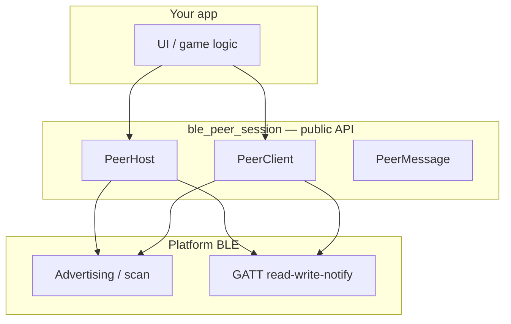
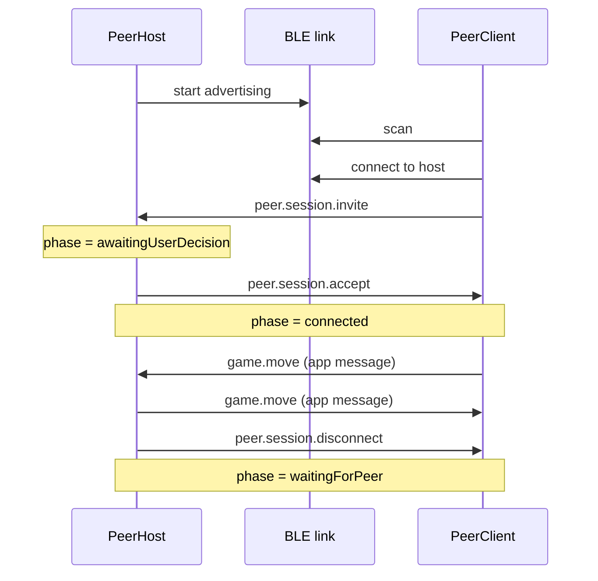
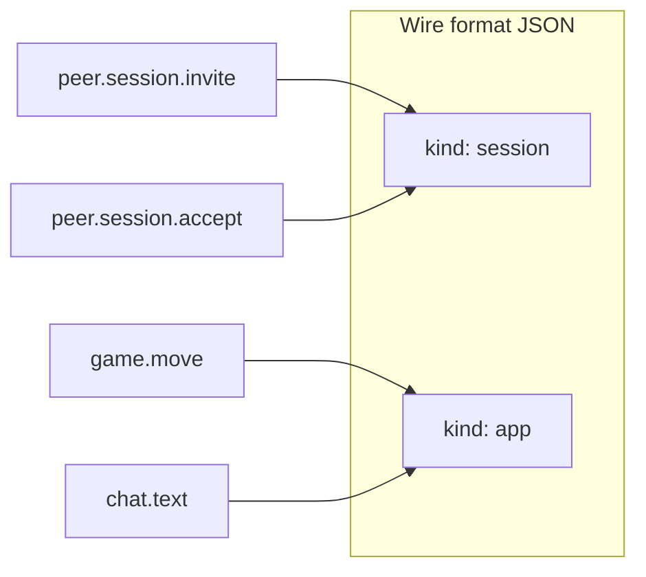
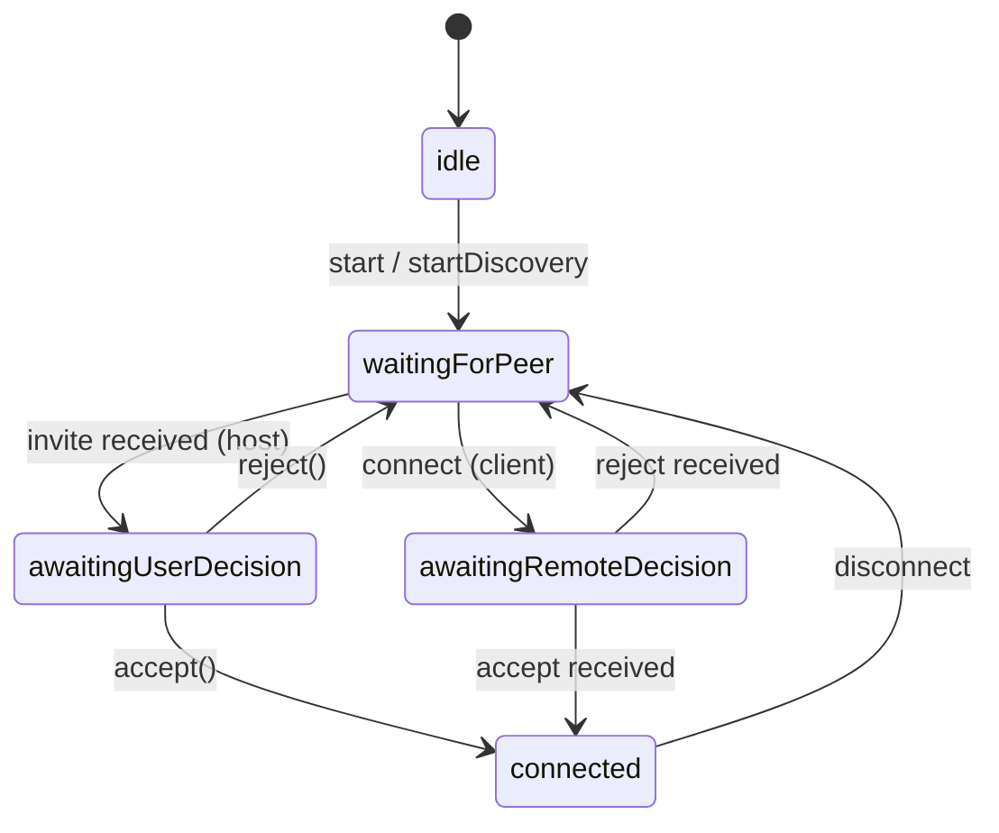

# ble_peer_session

Offline BLE peer-to-peer sessions for Flutter: discovery, consent handshake, and bidirectional messaging for local games and chat.

**Scope:** 1:1 BLE only (one host + one client). No Wi‑Fi or internet required.

## Table of contents

1. [Mental model](#mental-model)
2. [Quick start](#quick-start)
3. [Roles: host and client](#roles-host-and-client)
4. [Connection flow](#connection-flow)
5. [Messages](#messages)
6. [Connection phases](#connection-phases)
7. [Bluetooth adapter status](#bluetooth-adapter-status)
8. [Errors](#errors)
9. [Android setup](#android-setup)
10. [Migration from 0.1.x](#migration-from-01x)

---

## Mental model

Think of the package as three layers:



| Concept | What it means |
|--------|----------------|
| **Peer** | Entry point. Creates host or client, exposes adapter status and shared streams. |
| **PeerHost** | Waits for a connection (BLE peripheral + advertising). Accepts or rejects invites. |
| **PeerClient** | Scans for hosts, connects to one device, sends an invite. |
| **PeerMessage** | One envelope for handshake and app data (`type` + optional `payload`). |
| **PeerConnectionPhase** | High-level lifecycle: waiting → awaiting decision → connected. |
| **PeerException** | Single error type with [PeerErrorCode](doc/ERROR_CODES.md). |

**BLE in one sentence:** the host *advertises* a service UUID; the client *scans*, *connects*, and reads/writes a GATT characteristic. This package adds a JSON protocol and a consent handshake on top.

---

## Quick start

```dart
import 'package:ble_peer_session/ble_peer_session.dart';

final peer = Peer.create(
  config: BlePeerConfig(
    appName: 'MyApp',
    serviceUuid: '0000180d-0000-1000-8000-00805f9b34fb',
    characteristicUuid: '00002a37-0000-1000-8000-00805f9b34fb',
  ),
  logger: myLogger, // implements Logger
);

// Check Bluetooth before starting
peer.adapterStatusStream.listen((status) {
  if (status == PeerAdapterStatus.disabled) {
    // Show UI: ask user to enable Bluetooth in system settings
  }
});

final client = await peer.createClient();
await client.startDiscovery(localPeer: localEndpoint);

client.discoveredDevicesStream.listen((devices) { /* update list */ });
client.connectionStream.listen((info) { /* update UI by info?.phase */ });
client.messagesStream.listen((message) { /* handle invite / app data */ });
```

---

## Roles: host and client

Only **one role is active** at a time on a `Peer` instance. Switching roles resets the previous session.

| | Host (`PeerHost`) | Client (`PeerClient`) |
|--|-------------------|------------------------|
| BLE mode | Peripheral (advertises) | Central (scans + connects) |
| Typical device | “Create game” / “Wait for friend” | “Join game” / pick device |
| User action at invite | `accept()` or `reject()` | Already sent invite via `connect()` |
| Start | `host.start(localPeer: …)` | `client.startDiscovery(localPeer: …)` then `client.connect(device)` |

---

## Connection flow



Step-by-step (no BLE background needed):

1. **Host** calls `start()` — device becomes visible to nearby scanners.
2. **Client** calls `startDiscovery()` — sees devices in `discoveredDevicesStream`.
3. **Client** calls `connect(device)` — BLE link opens; client sends `peer.session.invite`.
4. **Host** receives invite on `messagesStream`; UI shows “Accept?”; host calls `accept()` or `reject()`.
5. On accept, both sides get `PeerConnectionPhase.connected`; use `send()` for app messages.
6. Either side calls `disconnect()` or sends `peer.session.disconnect` to tear down.

---

## Messages

All traffic uses a single type: `PeerMessage`.

### Reserved session types

| `type` | Direction | Meaning |
|--------|-----------|---------|
| `peer.session.invite` | Client → Host | Request to join |
| `peer.session.accept` | Host → Client | Invite accepted |
| `peer.session.reject` | Host → Client | Invite rejected |
| `peer.session.disconnect` | Either | Graceful close |

Use `PeerMessageTypes.isSessionType(type)` to filter handshake vs app traffic.

### Application messages

Pick any other `type` string (e.g. `game.move`, `chat.text`):

```dart
await host.send(
  PeerMessage(
    sender: localPeer,
    type: 'game.move',
    payload: {'row': 1, 'column': 2},
  ),
);
```



**MTU limit:** one message must fit in one GATT write/notify (~480 bytes JSON). Larger payloads need framing (see [BACKLOG.md](BACKLOG.md)).

---

## Connection phases



Map to UI with `connectionStream` → `PeerConnectionInfo.phase`.

---

## Bluetooth adapter status

The package **does not** turn Bluetooth on automatically. Observe status and guide the user:

```dart
peer.adapterStatusStream.listen((status) {
  switch (status) {
    case PeerAdapterStatus.disabled:
      // Show "Enable Bluetooth"
    case PeerAdapterStatus.unauthorized:
    case PeerAdapterStatus.unsupported:
      // Show explanation / fallback
    case PeerAdapterStatus.enabled:
      // Ready to start host or client
    default:
      break;
  }
});
```

Request runtime permissions (Android 12+) via `peer.permissions.checkPermissions()` before starting BLE.

---

## Errors

All failures throw `PeerException` with a `PeerErrorCode`. See [doc/ERROR_CODES.md](doc/ERROR_CODES.md).

```dart
try {
  await host.start(localPeer: endpoint);
} on PeerException catch (e) {
  switch (e.code) {
    case PeerErrorCode.bluetoothDisabled:
      // ...
    case PeerErrorCode.permissionsDenied:
      // ...
    default:
      // ...
  }
}
```

---

## Android setup

Add to `AndroidManifest.xml`:

```xml
<uses-permission android:name="android.permission.BLUETOOTH_SCAN" />
<uses-permission android:name="android.permission.BLUETOOTH_CONNECT" />
<uses-permission android:name="android.permission.BLUETOOTH_ADVERTISE" />
```

For Android 12+, call `peer.permissions.checkPermissions()` before BLE operations.

---

## Migration from 0.1.x

See [doc/MIGRATION.md](doc/MIGRATION.md).

---

## License

MIT
