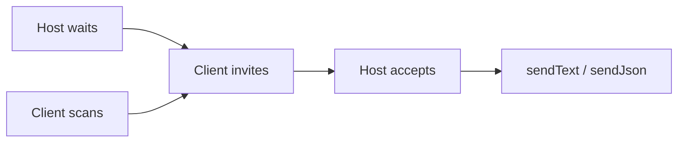
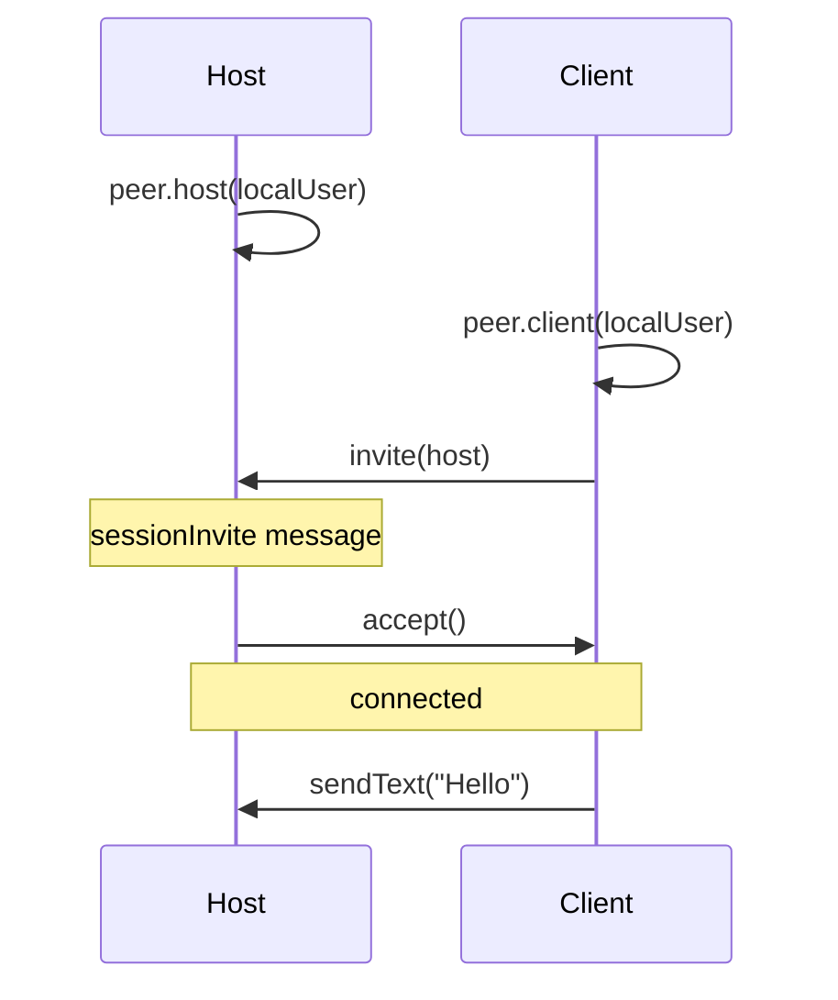

# ble_peer_session

Offline BLE peer-to-peer sessions for Flutter: discovery, consent handshake, and bidirectional messaging for local games and chat.

**Scope:** 1:1 only (one host + one client). No Wi‑Fi or internet required.

---

## 15-second start

### Host — wait for a friend

```dart
import 'package:ble_peer_session/ble_peer_session.dart';

final peer = Peer.create(appName: 'MyGame');

final host = await peer.host(
  localUser: PeerUser(id: 'me', displayName: 'Alice'),
);

host.messagesStream.listen((message) {
  if (message.type == PeerMessageTypes.sessionInvite) {
    host.accept(); // friend wants to join
  }
});

await host.sendText('Room is ready');
host.textMessages.listen(print);
```

### Client — find host and say hello

```dart
final peer = Peer.create(appName: 'MyGame');

final client = await peer.client(
  localUser: PeerUser(id: 'me', displayName: 'Bob'),
);

client.nearbyHostsStream.listen((hosts) {
  if (hosts.isEmpty) return;
  client.invite(hosts.first); // sends invite, not "BLE connect"
});

client.textMessages.listen(print);
await client.sendText('Hello!');
```

That is the whole mental model:

| Step | Host | Client |
|------|------|--------|
| Start | `peer.host(localUser: …)` | `peer.client(localUser: …)` |
| Find peer | waits | `nearbyHostsStream` |
| Connect | `accept()` on invite | `invite(host)` |
| Chat | `sendText()` / `textMessages` | same |

No UUIDs. No `PeerEndpoint`. No `type`/`payload` unless you need custom game data.

---

## Table of contents

1. [Two API levels](#two-api-levels)
2. [Mental model](#mental-model)
3. [Setup](#setup)
4. [Connection flow](#connection-flow)
5. [Custom messages (advanced)](#custom-messages-advanced)
6. [Bluetooth adapter](#bluetooth-adapter)
7. [Errors](#errors)
8. [Android setup](#android-setup)
9. [Message framing](#message-framing)
10. [Example app](#example-app)
11. [Migration guides](#migration-guides)

---

## Two API levels

### Level 1 — beginner (recommended)

| Concept | API |
|---------|-----|
| Entry | `Peer.create(appName: 'MyGame')` — UUIDs generated automatically |
| Who am I | `PeerUser(id: '…', displayName: '…')` |
| Host | `await peer.host(localUser: user)` |
| Client | `await peer.client(localUser: user)` |
| Nearby friend | `PeerNearby` in `nearbyHostsStream` |
| Connect | `client.invite(host)` |
| Text chat | `sendText()` / `textMessages` |
| Game JSON | `sendJson('game.move', {'row': 1})` / `jsonMessages` |

### Level 2 — advanced (full control)

| Concept | API |
|---------|-----|
| Custom UUIDs | `Peer.create(config: BlePeerConfig(...), logger: logger)` |
| Wire endpoint | `startWithEndpoint` / `startDiscoveryWithEndpoint` |
| Raw device | `connect(device)` |
| Any payload | `PeerMessage.app(type: '…', payload: …)` |
| Session types | `PeerMessageTypes.sessionInvite`, etc. |

---

## Mental model

Think in **people and invitations**, not BLE:



Under the hood: advertising, GATT, JSON frames — you never need to touch that for basic use.

---

## Setup

```dart
final peer = Peer.create(appName: 'MyGame');

// Optional: check Bluetooth before starting
if (peer.adapterStatus == PeerAdapterStatus.disabled) {
  // show "Enable Bluetooth" UI
}

// Android 12+
await peer.permissions.checkPermissions();
```

Custom UUIDs (only if you know why):

```dart
final peer = Peer.create(
  config: BlePeerConfig(
    appName: 'MyGame',
    serviceUuid: '0000180d-0000-1000-8000-00805f9b34fb',
    characteristicUuid: '00002a37-0000-1000-8000-00805f9b34fb',
  ),
  logger: myLogger,
);
```

---

## Connection flow



Phases (`connectionStream` → `PeerConnectionPhase`):

- `waitingForPeer` — host advertising / client browsing
- `awaitingUserDecision` — host sees invite, call `accept()` or `reject()`
- `awaitingRemoteDecision` — client sent invite, waiting
- `connected` — send messages

---

## Custom messages (advanced)

```dart
// Typed app message
await host.sendJson('game.move', {'row': 1, 'column': 2});

// Or full control
await host.send(
  PeerMessage.app(
    sender: host.localEndpoint!,
    type: 'game.move',
    payload: {'row': 1, 'column': 2},
  ),
);
```

Reserved session types (`PeerMessageTypes.*`) are handled automatically during handshake.

---

## Bluetooth adapter

The package **does not** turn Bluetooth on. Observe status and guide the user:

```dart
peer.adapterStatusStream.listen((status) {
  switch (status) {
    case PeerAdapterStatus.disabled:
      // prompt user
    case PeerAdapterStatus.enabled:
      // ready
    default:
      break;
  }
});
```

---

## Errors

All failures throw `PeerException` with `PeerErrorCode`. See [doc/ERROR_CODES.md](doc/ERROR_CODES.md).

---

## Android setup

Add to `AndroidManifest.xml`:

```xml
<uses-permission android:name="android.permission.BLUETOOTH_SCAN" />
<uses-permission android:name="android.permission.BLUETOOTH_CONNECT" />
<uses-permission android:name="android.permission.BLUETOOTH_ADVERTISE" />
```

---

## Message framing

One GATT write/notify carries one **frame**. Logical JSON messages larger than the effective MTU are split automatically on the link layer — you do not need to chunk in app code.

| Limit | Default |
|-------|---------|
| Chunk payload | 480 bytes |
| Max logical message | 256 KiB |

Oversized sends throw `PeerException` with `PeerErrorCode.payloadTooLarge`. Corrupt or incomplete frames emit `PeerErrorCode.messageDecodeFailed`.

Wire layout (big-endian):

```
[version:1][flags:1][messageId:2][chunkIndex:2][totalChunks:2][payload…]
```

Legacy peers that send raw JSON without the framing header (`version != 0x01`) are still accepted on receive.

---

## Example app

`example/minimal_chat` demonstrates host/client roles and text chat with zero custom UUID setup.

```bash
cd example/minimal_chat
flutter pub get
flutter run
```

On two physical devices:

1. Install the app on both phones and grant Bluetooth permissions.
2. Device A: **Host — wait for friend**.
3. Device B: **Client — find host**, tap the discovered host.
4. Host auto-accepts the invite; send messages both ways.

Same `appName` (`MinimalChat` in the example) is required so both sides share service UUIDs.

---

## Migration guides

- [0.1.x → 0.2.0](doc/MIGRATION.md)
- [0.2.x → 0.3.0](doc/MIGRATION_0.3.md)

---

## License

MIT
